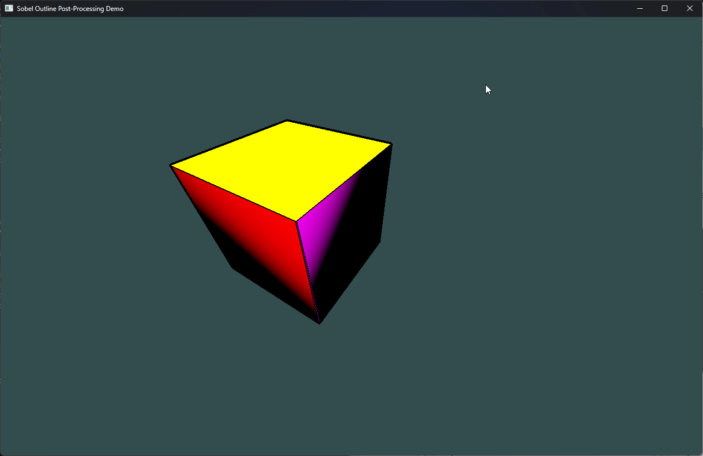
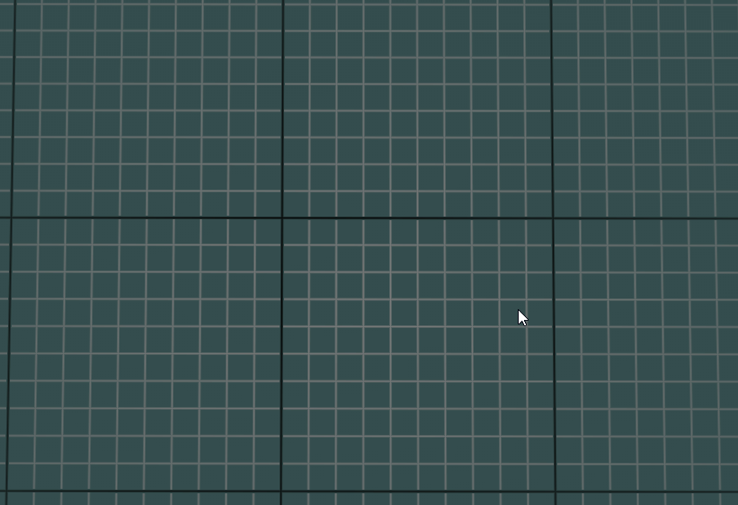
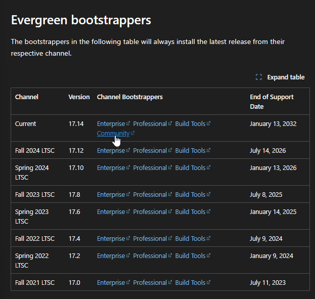

# Showcase
* Sobel Line Detection using Normal and Depth Maps FBO for the Fragment Shader


* Endless Grid Demo Topdown View (uses derivatives and log base 10 to compute this shader. Special Thanks goes to OGLDev for the youtube tutorial I used to follow along. I modified the shader code to fit the needs of the game engine)



* Inverted Hull (Add outline to sphere) + Cel Shading + Half Lambert Lighting


# Software Dependencies List
* Visual Studio 2022
* VCPKG
* Ninja Build Generator
* EMSDK 6.0.2 for emscripten web builds
  * Pyenv for windows
  * Python 3.10 or higher

# Install Visual Studio 2022 MSCVC 2022 Developer console
* To install the MSVC 2022 Developer console, follow this link:
* https://learn.microsoft.com/en-us/visualstudio/releases/2022/release-history#evergreen-bootstrappers
* Under Evergreen bootstrappers, install the community version

* Follow the on screen instructions of the installer and ensure `MSVC 2022 Developer console` is included as part of the installation process


# How to install vcpkg on Windows?
* vcpkg is a C++ package manager that allows you to install 3rd party libraries for your C++ project
* Follow the steps outlined in the link below to install vcpkg:
* https://learn.microsoft.com/en-us/vcpkg/get_started/get-started?pivots=shell-powershell
* **NOTE:** installation is via manifest mode through the `vcpkg.json` file

# How to let CMake know where your vcpkg installation is located?
* create a `CMakeUserPresets.json` file in the root of this project
* Copy / Paste this template into `CMakeUserPresets.json`
* Replace `<path to vcpkg>` with the **absolute path** to your vcpkg installation folder path

```json
{
  "version": 3,
  "configurePresets": [
    {
      "name": "desktop-local",
      "inherits": "desktop",
      "environment": {
        "VCPKG_ROOT": "<absolute-path-to-vcpkg-folder>",
        "MSVC_COMPILER_ROOT": "<absolute-path-to-msvc-2022-compiler-folder>"
      }
    },
    {
      "name": "web-local",
      "inherits": "web",
      "environment": {
        "VCPKG_ROOT": "<absolute-path-to-vcpkg-folder>",
        "EMSDK": "<absolute-path-to-emsdk-folder>",
        "Path": "<absolute-path-to-folder-containing-embedded-emsdk-python-executable>;$penv{Path}"
      }
    }
  ]
}
```

**NOTE:** For the `Path` environment variable, this will be the absolute path to the folder containing the embedded emsdk python executable. For example, the absolute path could be `C:\\Cpp\\emsdk\\python\\3.13.3_64bit` on Windows machines. This fixes an error where the embedded emsdk python version cannot be found where cmake stops the configuration step prematurely.


How to add Developer Powershell (VS 2022) as a terminal option onto Visual Studio Code?
1. Hit Ctrl + Shift + p to open up the search bar
2. type in "Preferences: Open User Settings (JSON)" in the search bar
3. Paste in the Developer Powershell (VS 2022) settings below:
```json
    "terminal.integrated.profiles.windows": {
        
        "CMD Prompt": {
            "path": "C:\\Windows\\System32\\cmd.exe"
        },
        "Developer PowerShell (VS 2022)": {
            "source": "PowerShell",
            "icon": "terminal-powershell",
            "args": [
                "-NoExit",
                "-ExecutionPolicy", "Bypass",
                "-Command", 
                "& 'C:\\Program Files\\Microsoft Visual Studio\\2022\\Community\\Common7\\Tools\\Launch-VsDevShell.ps1'",
                "-Arch amd64",
                "-SkipAutomaticLocation"
            ]
        }
    },
```

How to install EMSDK 6.0.2 for web builds?
* Follow installation instructions from https://emscripten.org/docs/getting_started/downloads.html#sdk-download-and-install
* For installation instead of typing in `latest` use `6.0.2` as it contains the emcc.exe file required to compile the project for web builds. Do this for all installation commands that contain the word `latest` in it.
* For example `env install latest` should be `emsdk install 6.0.2`

How to build project using cmake?
```powershell
# You must use the Developer Powershell (VS 2022) in order to run the desktop build successfully.
# To obtain the shell, you need to install Visual Studio 2022 Community edition.
# Configures using desktop preset
cmake --preset desktop-local

# You must use Vanilla Powershell (without the VS 2022 dependencies) as this build will use the Clang Compiler and not the MSVC compiler to compile the webgl project
# Builds using desktop preset
cmake --build --preset desktop-build --clean-first

# Configures using web preset
cmake --preset web-local

# Builds using web preset
cmake --build --preset web-build --clean-first
```

What does the --build command do in cmake?
* builds the artifacts in the build folder. Building involves running a c++ compiler to compile the code, link library dependencies, include `.dll` files required as dependencies, and ensure header files are included in order for a successful compilation. `--clean-first` command deletes previously built object files, libraries, and executables before starting a new build.

How to clear build folder for fresh install?
* delete the `build` folder from your machine by opening windows explorer and moving the `build` folder to the recycling bin.

Powershell commands usage example for a hello world app
```bash
# generates a vcpkg.json file containing the dependencies installed
vcpkg new --application

# adds the fmt library to vcpkg.json in manifest mode
vcpkg add port fmt

# tells cmake to configure the build with vcpkg linked as a dependency to manage packages
cmake --preset=default

# tells cmake to compile the c++ project using the compiler and settings its configured with from the previous step
# build gets stored in the build folder on success
cmake --build build

# run the app
.\build\HelloWorld.exe
```

How to run the emscripten build on a web browser?
* After you finish running the configuration and build steps in cmake for the web build, do the following steps:
```powershell
# You should have GameMathGym.html, GameMathGym.js, and GameMathGym.wasm compiled successfully by emscripten in the folder you are going to cd into
cd build/web
# start the python server -- access project http://localhost:8000/GameMathGym.html
python -m http.server 8000
```

How to run unit tests on desktop builds?
```powershell
# 1. build the project
cmake --build --preset desktop-build
# 2. run the tests -- will output error logs on console if any test fails
ctest --preset unit-tests-desktop 
```

How to test github actions locally?
* install nektos/act by visiting their github page for installation instructions
* install docker desktop on windows
```powershell
# This will simulate a manual deployment as if it was running on github actions except it will run in a contained docker image called catthehacker/ubuntu:act-24.04
# I would use 26.04 but it doesn't exist yet for this package (https://nektosact.com/usage/runners.html)
act workflow_dispatch -P ubuntu-24.04=catthehacker/ubuntu:act-24.04
```